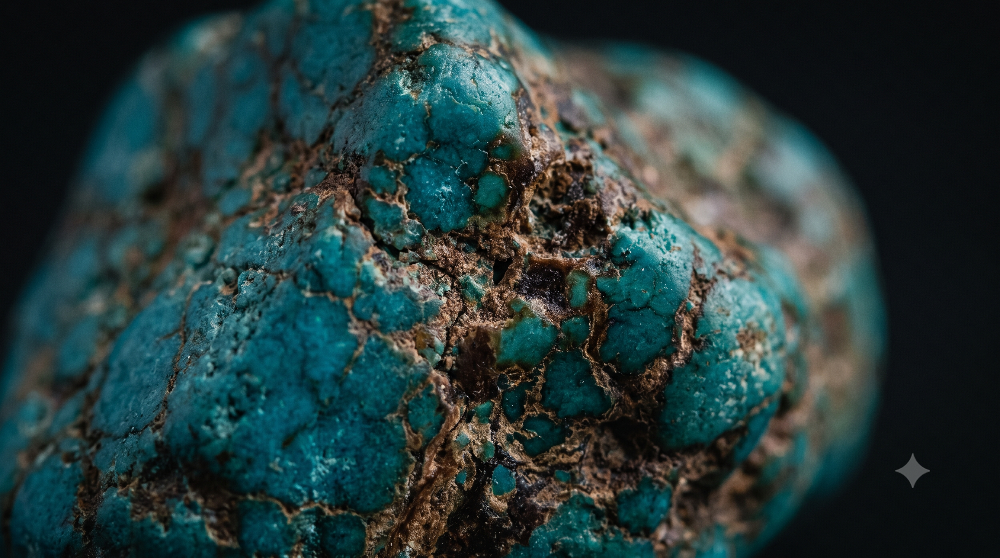
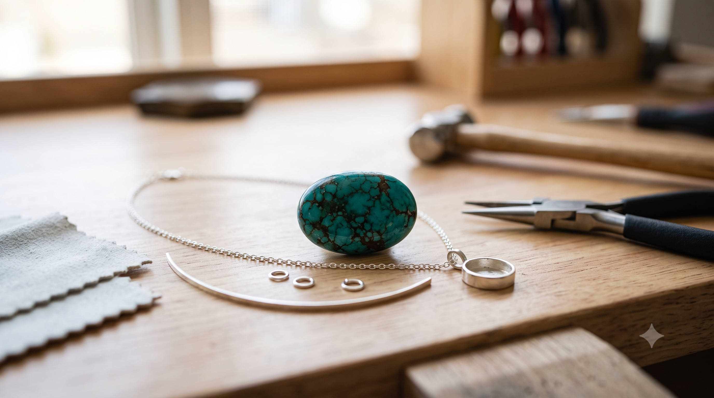
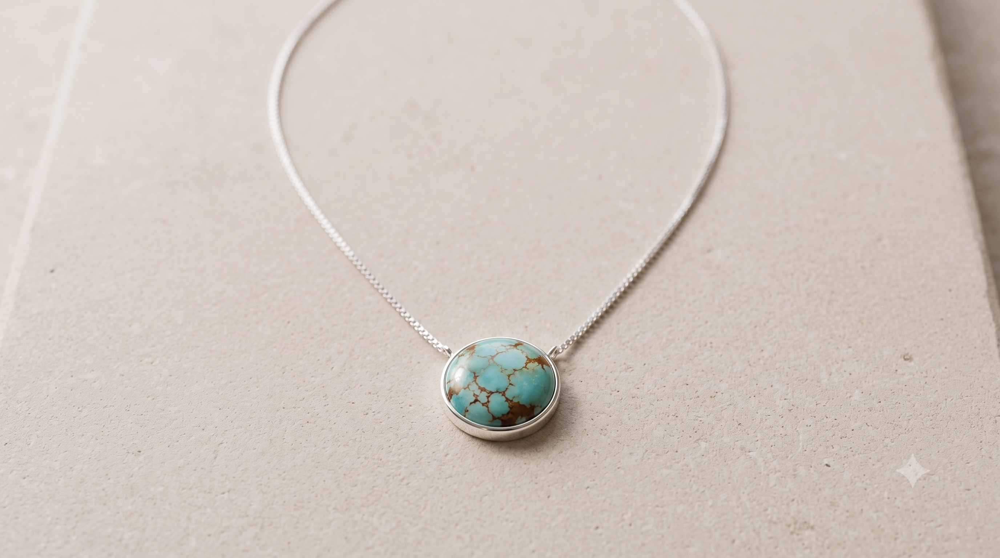
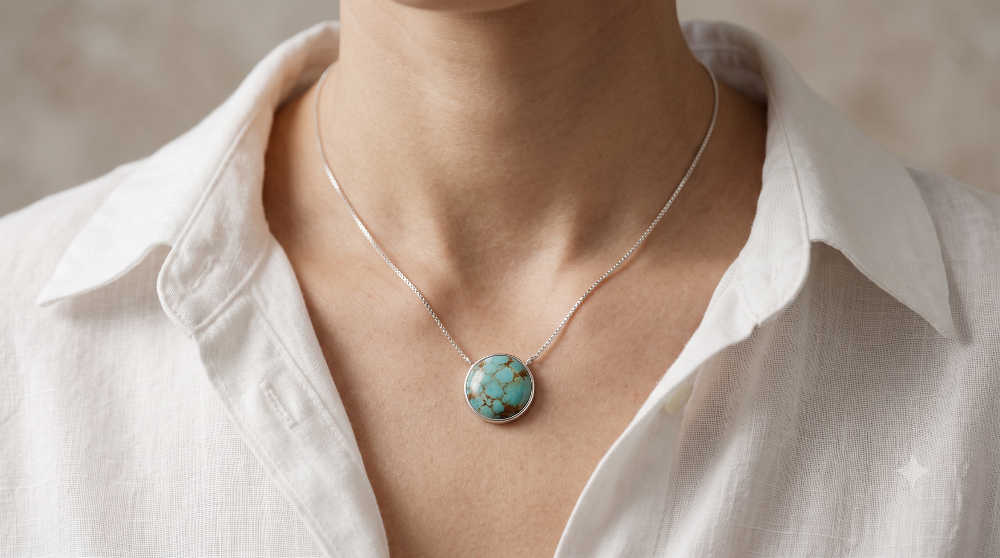

# ORIGIN BLUE 광고 스토리보드 및 제작 문서

이 문서는 작성 후 PDF로 내보내 제출용 스토리보드 문서로 사용한다.
동일한 스토리보드를 **Google Gemini Pro**와 **Google Flow** 두 도구로 각각 통째로 제작해 두 버전을 비교한다.

## 1. 프로젝트 정보

| 항목        | 내용                                                                |
| --------- | ----------------------------------------------------------------- |
| 프로젝트명     | ORIGIN BLUE 10초 브랜드 광고                                            |
| 브랜드명      | ORIGIN BLUE                                                       |
| 제품        | 천연 터키석 모던 목걸이                                                     |
| 최종 영상 파일명 | `과제-gemini.mov` (Gemini 버전) / `과제-googleflow.mp4` (Flow 버전) |
| 목표 길이     | 10초 이내                                                            |
| 목표 비율/해상도 | 16:9, 1280x720                                                    |
| 최종 코덱     | H.264 / AAC 권장                                                    |
| 사용 도구     | Google Gemini Pro, Google Flow (두 개만 사용)                          |

## 2. 브랜드 아이덴티티

- 브랜드명: ORIGIN BLUE
- 브랜드 유형: 가상 주얼리 브랜드
- 타겟: 20~40대, 천연 소재와 절제된 디자인을 선호하는 소비자
- 톤앤매너: 미니멀, 프리미엄, 자연광, 차분한 청록색, 섬세한 세공감
- 차별점(USP): 합성 터키석이 아닌 천연 터키석의 고유한 결, 색, 희소성을 살린 1점성 목걸이
- 브랜드 키워드: natural turquoise, modern necklace, quiet luxury, organic pattern, handcrafted detail
- 사용 금지 요소: 플라스틱 질감, 과한 형광색, 과장된 보석 반짝임, 복잡한 장식, 유사 명품 로고

## 3. 캠페인 정의

- 광고 목적: 브랜드 인지
- 핵심 메시지 한 문장: “합성이 아닌, 시간이 만든 푸른빛을 목에 걸다.”
- 전달할 감정: 차분함, 신뢰감, 희소성, 자연의 아름다움
- CTA 또는 마지막 화면 문구: `ORIGIN BLUE - Wear the blue made by time.`
- 스토리 구조: 천연 터키석 원석의 결 발견 -> 세공을 거쳐 모던한 목걸이로 완성 -> 완성된 목걸이 제품 팩샷 -> 모델 착용샷 -> 브랜드명·슬로건 엔딩

## 4. 사용 도구 계획

동일한 4씬 스토리보드를 두 도구로 각각 제작한다. 각 버전은 이미지·비디오·오디오·편집을 모두 해당 도구 하나로 완성한다.

| 영역 | Gemini 버전 도구 | Flow 버전 도구 | 사용 목적 |
|---|---|---|---|
| 이미지 생성 | Google Gemini Pro | Google Flow | 천연 터키석 질감, 제품 클로즈업, 착용 컷 키비주얼 생성 |
| 비디오 생성/변환 | Google Gemini Pro | Google Flow | 정지 컷을 짧은 모션 컷으로 변환하거나 직접 생성 |
| 오디오 생성 | Google Gemini Pro | Google Flow | 짧은 광고에 맞는 미니멀 앰비언트 배경음/효과음 생성 |
| 편집/합성 | Google Gemini Pro | Google Flow | 컷 연결, 자막, 브랜드명, CTA, 오디오 통합 |

**도구 선택 이유**

- Google Gemini Pro: 텍스트 프롬프트로 이미지의 질감·구도·색을 세밀하게 통제하기 쉽고, 생성한 이미지를 그대로 짧은 모션으로 이어갈 수 있어 제품 톤을 정확히 고정하는 버전에 적합해 선택.
- Google Flow(Veo 기반): 텍스트·이미지에서 영상과 오디오를 함께 생성해 자연광·인물 움직임 같은 시네마틱 시퀀스를 빠르게 확보할 수 있어, 감성 중심 영상 버전에 적합해 선택.

## 5. 제작 파이프라인

1. ORIGIN BLUE의 핵심 메시지와 4씬 구조를 확정한다.
2. 이미지 프롬프트에서 `natural turquoise matrix veins`, `modern minimal necklace`, `soft daylight`, `quiet luxury` 키워드를 고정한다.
3. Gemini 버전: Google Gemini Pro로 씬별 키비주얼 이미지를 생성하고, 이를 짧은 모션 컷으로 변환한다.
4. Flow 버전: Google Flow로 동일한 4씬을 이미지/프레임과 비디오로 생성한다.
5. 각 버전의 오디오(차분한 앰비언트 배경음)를 해당 도구로 생성한다.
6. 각 버전을 해당 도구 안에서 컷 연결, 카피, 브랜드명, CTA, 오디오 레벨까지 통합한다.
7. 두 버전을 동일 기준으로 비교해 최종본을 선택한다.
8. 각 버전을 10초 이내 MP4로 내보내고 최종 스펙을 기록한다.

## 6. 파일명 규칙

```text
# 씬별 키비주얼 이미지 (Gemini Pro 생성)
scene1.png   # 씬 1 터키석 매크로
scene2.png   # 씬 2 세공 과정
scene3.png   # 씬 3 브랜드 팩샷
scene4.png   # 씬 4 착용 컷

# 최종 영상
과제-gemini.mov        # Gemini 버전
과제-googleflow.mp4    # Google Flow 버전

mission2.pdf
```

## 7. 씬별 스토리보드

### 씬 1


| 필드            | 내용                                                                                                                                                                                                                       |
| ------------- | ------------------------------------------------------------------------------------------------------------------------------------------------------------------------------------------------------------------------ |
| 씬 번호 / 길이     | 씬 1 / 2초                                                                                                                                                                                                                 |
| 목표 메시지        | 천연 터키석은 합성석과 달리 고유한 결을 가진다는 점을 첫 컷에서 각인한다.                                                                                                                                                                               |
| 화면 구성         | 극단적 매크로 클로즈업, 천연 터키석의 청록색과 갈색 매트릭스 결, 어두운 미니멀 배경, 텍스트 없음                                                                                                                                                                 |
| 내레이션 또는 화면 카피 | “Not synthetic.”                                                                                                                                                                                                         |
| 이미지 도구 / 목적   | Google Gemini Pro(Gemini 버전) · Google Flow(Flow 버전) / 천연 터키석 질감 키비주얼 생성                                                                                                                                                  |
| 비디오 도구 / 목적   | Google Gemini Pro(Gemini 버전) · Google Flow(Flow 버전) / 아주 느린 줌인 모션 생성                                                                                                                                                     |
| 오디오 도구 / 목적   | Google Gemini Pro(Gemini 버전) · Google Flow(Flow 버전) / 낮고 차분한 앰비언트 시작음                                                                                                                                                    |
| 입력 프롬프트 원문    | `macro close-up of natural turquoise stone with organic brown matrix veins, matte mineral texture, deep blue green color, soft daylight, minimal luxury jewelry campaign, no plastic shine, no fake gemstone look, 16:9` |
| 출력 결과 요약      | 천연 터키석의 불규칙한 결과 미네랄 질감이 강조된 시작 컷 확보                                                                                                                                                                                      |
| 결과 파일명 또는 링크  | `scene1.png`                                                                                                                                                                                                            |

### 씬 2


| 필드            | 내용                                                                                                                                                                                                                                  |
| ------------- | ----------------------------------------------------------------------------------------------------------------------------------------------------------------------------------------------------------------------------------- |
| 씬 번호 / 길이     | 씬 2 / 2초                                                                                                                                                                                                                            |
| 목표 메시지        | 천연 원석이 절제된 세공을 통해 주얼리로 완성되는 과정을 보여준다.                                                                                                                                                                                               |
| 화면 구성         | 작업대 위 터키석과 얇은 실버 또는 화이트골드 체인, 손은 일부만 보이거나 제외, 자연광, 텍스트 없음                                                                                                                                                                           |
| 내레이션 또는 화면 카피 | “Made by earth. Refined by hand.”                                                                                                                                                                                                   |
| 이미지 도구 / 목적   | Google Gemini Pro(Gemini 버전) · Google Flow(Flow 버전) / 세공 과정과 소재의 진정성 표현                                                                                                                                                            |
| 비디오 도구 / 목적   | Google Gemini Pro(Gemini 버전) · Google Flow(Flow 버전) / 좌우로 느린 슬라이드 모션 생성                                                                                                                                                            |
| 오디오 도구 / 목적   | Google Gemini Pro(Gemini 버전) · Google Flow(Flow 버전) / 은은한 금속성 효과음 또는 부드러운 음악 전개                                                                                                                                                    |
| 입력 프롬프트 원문    | `natural turquoise cabochon on a clean jeweler workbench, modern minimal silver necklace components, handcrafted fine jewelry process, soft morning light, quiet luxury editorial, shallow depth of field, realistic texture, 16:9` |
| 출력 결과 요약      | 원석과 모던한 목걸이 부품이 함께 보이는 제작 과정 컷 확보                                                                                                                                                                                                   |
| 결과 파일명 또는 링크  | `scene2.png`                                                                                                                                                                                                                       |

### 씬 3


| 필드            | 내용                                                                                                                                                                                                                                    |
| ------------- | ------------------------------------------------------------------------------------------------------------------------------------------------------------------------------------------------------------------------------------- |
| 씬 번호 / 길이     | 씬 3 / 3초                                                                                                                                                                                                                              |
| 목표 메시지        | 세공을 거쳐 완성된 1점성 천연 터키석 목걸이 자체의 제품 매력을 정면으로 보여준다.                                                                                                                                                                                       |
| 화면 구성         | 제품 단독 팩샷, 밝은 석재 또는 무광 배경, 중앙에 완성된 목걸이, 텍스트 없음                                                                                                                                                                                        |
| 내레이션 또는 화면 카피 | (텍스트 없음, 제품 단독 노출)                                                                                                                                                                                                                    |
| 이미지 도구 / 목적   | Google Gemini Pro(Gemini 버전) · Google Flow(Flow 버전) / 완성 제품 팩샷 생성                                                                                                                                                                    |
| 비디오 도구 / 목적   | Google Gemini Pro(Gemini 버전) · Google Flow(Flow 버전) / 아주 느린 줌아웃 또는 빛 변화 모션 생성                                                                                                                                                        |
| 오디오 도구 / 목적   | Google Gemini Pro(Gemini 버전) · Google Flow(Flow 버전) / 제품이 드러나며 살짝 고조되는 앰비언트                                                                                                                                                          |
| 입력 프롬프트 원문    | `premium product packshot of a modern minimal natural turquoise necklace on matte light stone surface, centered composition, quiet luxury, soft daylight, realistic turquoise matrix veins, clean negative space for logo text, 16:9` |
| 출력 결과 요약      | 완성된 목걸이의 미니멀 제품 팩샷 확보                                                                                                                                                                                                                |
| 결과 파일명 또는 링크  | `scene3.png`                                                                                                                                                                                                                          |

### 씬 4


| 필드            | 내용                                                                                                                                                                                                                                                                  |
| ------------- | ------------------------------------------------------------------------------------------------------------------------------------------------------------------------------------------------------------------------------------------------------------------- |
| 씬 번호 / 길이     | 씬 4 / 3초 (마지막 구간에 브랜드 엔딩 오버레이)                                                                                                                                                                                                                                      |
| 목표 메시지        | 완성된 목걸이가 일상적인 스타일에도 세련된 포인트가 된다는 점을 실제 착용 이미지로 보여주고, 마지막에 브랜드명·슬로건으로 광고를 마무리한다.                                                                                                                                                                                     |
| 화면 구성         | 인물의 얼굴은 제외하거나 하관/목선만 노출, 흰 셔츠, 천연 터키석 목걸이 클로즈업 → 마지막 구간에 `ORIGIN BLUE` 브랜드명과 슬로건 오버레이                                                                                                                                                                               |
| 내레이션 또는 화면 카피 | “A blue no one else can wear.” → `ORIGIN BLUE` / `Wear the blue made by time.`                                                                                                                                                                                      |
| 이미지 도구 / 목적   | Google Gemini Pro(Gemini 버전) · Google Flow(Flow 버전) / 착용 컷 생성 및 브랜드 엔딩 화면 구성                                                                                                                                                                                        |
| 비디오 도구 / 목적   | Google Gemini Pro(Gemini 버전) · Google Flow(Flow 버전) / 목걸이를 따라가는 미세한 틸트업 후 브랜드 텍스트 페이드인                                                                                                                                                                              |
| 오디오 도구 / 목적   | Google Gemini Pro(Gemini 버전) · Google Flow(Flow 버전) / 감정이 고조되며 여운을 남기는 엔딩 코드                                                                                                                                                                                        |
| 입력 프롬프트 원문    | `modern minimal natural turquoise necklace worn on a model, close-up of neck and collarbone only, white shirt, quiet luxury jewelry campaign, realistic natural turquoise matrix veins, elegant silver chain, soft daylight, shallow depth of field, no face, 16:9` |
| 출력 결과 요약      | 착용 분위기와 브랜드 엔딩으로 마무리되는 마지막 컷 확보                                                                                                                                                                                                                                     |
| 결과 파일명 또는 링크  | `scene4.png`                                                                                                                                                                                                                                                        |

## 8. 프롬프트 개선 로그

| 항목        | 내용                                                                                                                                                                                                                                                                  |
| --------- | ------------------------------------------------------------------------------------------------------------------------------------------------------------------------------------------------------------------------------------------------------------------- |
| 대상 씬      | 씬 4 착용 컷                                                                                                                                                                                                                                                            |
| 수정 전 의도   | 모던한 목걸이 착용 장면을 만들고자 함                                                                                                                                                                                                                                               |
| 수정 전 프롬프트 | `turquoise necklace on a woman, luxury jewelry ad, beautiful light, modern style`                                                                                                                                                                                   |
| 발생한 문제    | 얼굴과 의상이 과하게 강조되고, 터키석이 합성 보석처럼 균일하고 형광색에 가깝게 표현될 가능성이 높음                                                                                                                                                                                                            |
| 수정 후 프롬프트 | `modern minimal natural turquoise necklace worn on a model, close-up of neck and collarbone only, white shirt, quiet luxury jewelry campaign, realistic natural turquoise matrix veins, elegant silver chain, soft daylight, shallow depth of field, no face, 16:9` |
| 수정 이유     | 제품과 천연 터키석의 결을 중심에 두기 위해 얼굴 노출을 줄이고, natural matrix veins와 no face 조건을 추가함                                                                                                                                                                                          |
| 결과 변화     | 인물보다 목걸이에 시선이 집중되고, 천연석의 불규칙한 무늬와 프리미엄 톤이 더 분명해짐                                                                                                                                                                                                                    |

## 9. 보너스 과제: 동일 스토리보드 다른 도구 재제작

| 항목             | 내용                                                                                                                                                                                                                                                                                  |
| -------------- | ----------------------------------------------------------------------------------------------------------------------------------------------------------------------------------------------------------------------------------------------------------------------------------- |
| 재제작 대상         | 전체 4씬 (동일 스토리보드)                                                                                                                                                                                                                                                                    |
| 1차 제작 도구       | Google Gemini Pro 단독                                                                                                                                                                                                                                                                |
| 재제작(비교) 도구     | Google Flow 단독                                                                                                                                                                                                                                                                      |
| 동일하게 유지할 조건    | 16:9, 4씬 구조, 목선 클로즈업, 얼굴 제외, 흰 셔츠, 천연 터키석 매트릭스 결, 미니멀 실버 체인, 자연광, 동일 카피/CTA                                                                                                                                                                                                         |
| 비교 기준          | 터키석 질감의 자연스러움, 목걸이 디자인의 모던함, 색감의 절제, 카메라 무빙의 안정성, 오디오 톤 적합성, 브랜드 톤 적합성                                                                                                                                                                                                              |
| Gemini 버전 프롬프트 | `A modern minimal natural turquoise necklace on a model's neck and collarbone, no face visible, white shirt, realistic turquoise stone with organic brown matrix veins, elegant thin silver chain, soft daylight, quiet luxury jewelry advertisement, shallow depth of field, 16:9` |
| Flow 버전 프롬프트   | `A modern minimal natural turquoise necklace on a model's neck and collarbone, no face visible, white shirt, realistic turquoise stone with organic brown matrix veins, elegant thin silver chain, soft daylight, quiet luxury jewelry advertisement, shallow depth of field, 16:9` |
| 결과 기록          | 두 버전 모두 동일 4씬(원석→세공→완성 팩샷→착용)을 10초 / 1280×720 / H.264+AAC(스테레오)로 완성. 대표 프레임 비교: **Gemini 버전**은 실버 체인·라운드 베젤에 차분한 무광 스튜디오 톤으로 브랜드가 정의한 '미니멀 실버 체인·quiet luxury'에 부합. **Flow 버전**은 자연광·올리브 배경의 시네마틱 톤이 강하나, 체인이 골드로 표현되고 착용 컷에 인물 얼굴이 정면 노출되어 스토리보드의 '실버 체인'·'얼굴 제외' 조건과 차이가 있었음. 파일 크기는 Gemini `.mov` 6.4MB, Flow `.mp4` 2.2MB. |
| 최종 선택          | 브랜드 아이덴티티(미니멀 실버 체인, 얼굴 제외, quiet luxury) 부합도가 높은 **Gemini 버전(`과제-gemini.mov`)**을 기본 제출본으로, Flow 버전(`과제-googleflow.mp4`)은 도구 비교/보너스 자료로 첨부. (전체 재생 후 최종 확정 권장) |

## 10. 멀티모달 이슈 대응 기록

| 이슈              | 대응 전략                                                                                           | 적용 여부                         |
| --------------- | ----------------------------------------------------------------------------------------------- | ----------------------------- |
| 터키석이 합성석처럼 보임   | `natural turquoise`, `organic matrix veins`, `matte mineral texture`, `no plastic shine` 키워드 고정 | 적용 (전 씬 프롬프트에 반영)             |
| 목걸이가 과하게 클래식해짐  | `modern minimal necklace`, `thin silver chain`, `quiet luxury` 키워드 사용                           | 적용                            |
| 해상도/비율 혼재       | 모든 이미지/비디오 프롬프트와 설정에 16:9 명시                                                                    | 적용 (출력 1280×720, 전 컷 16:9 유지) |
| 오디오 톤 불일치       | 밝은 팝 대신 미니멀 앰비언트, 낮은 템포, 고급스러운 엔딩 코드 사용                                                         | 적용 (두 버전 모두 오디오 트랙 포함)        |
| 크레딧 부족          | 4씬 유지, 정지 이미지 기반 짧은 패닝/줌 중심으로 제작                                                                | 적용 (4씬 구성 유지)                 |
| 도구별 결과 차이       | 동일 프롬프트로 Gemini Pro와 Google Flow 두 버전을 만들어 브랜드 톤에 더 맞는 쪽을 최종 선택                                 | 적용 (Gemini/Flow 2버전 제작·비교)    |
| 버전 간 소재·디테일 불일치 | Flow 버전에서 체인이 골드로, 착용 컷에 얼굴이 노출됨 → 브랜드 기준(실버 체인·얼굴 제외)에 부합하는 Gemini 버전을 최종본으로 선택                | 적용                            |

## 11. 최종 영상 정보

| 항목 | 내용 |
|---|---|
| 파일명 | `과제-gemini.mov` (Gemini 버전) / `과제-googleflow.mp4` (Flow 버전) |
| 길이 | 10초 |
| 해상도 | 1280x720 (16:9) |
| 프레임레이트 | 24fps |
| 비디오 코덱 | H.264 |
| 오디오 코덱 | AAC |
| 포함된 AI 시각 소스 | Google Gemini Pro 이미지·영상(Gemini 버전), Google Flow 이미지·영상(Flow 버전) |
| 포함된 AI 청각 소스 | Google Gemini Pro / Google Flow 생성 배경음·효과음 |
| 마지막 브랜드 인지 장치 | 씬 4 착용샷 마지막 구간에 `ORIGIN BLUE` 브랜드명 + `Wear the blue made by time.` 슬로건 오버레이로 마무리 |
