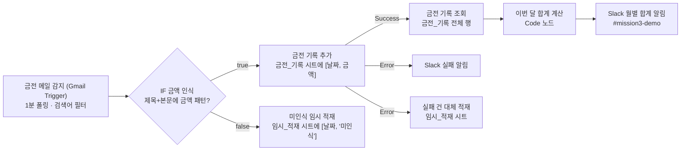

# 프로젝트 2 — 금전 메일 자동 수집·정리 (n8n)

## 1. 자동화할 반복 업무 정의

카드 결제 승인, 계좌 입금, 정기 청구, 영수증 같은 **금전 관련 메일이 여러 Gmail 계정으로 흩어져 들어온다.** 지금은 이걸 사람이 눈으로 훑어 금액을 옮겨 적고, 월말에 합계를 따로 계산한다. 메일 한 건당 1~2분이지만 하루에 여러 건 쌓이면 월 단위로 상당한 시간이 든다.

**자동화 대상**: 금전 관련 메일이 도착하면 → 금액을 추출해 → 시트에 날짜·금액으로 적재하고 → 이번 달 누적 합계를 Slack으로 알린다.

**기록 항목을 날짜·금액 두 가지로 제한한 이유**: 가계 집계에 필요한 최소 정보만 남기기 위해서다. 발신처·카드번호·주문번호 같은 식별 정보를 저장하지 않으므로, 과제 제출물(캡처)에 민감정보가 실릴 위험도 함께 제거된다.

## 2. 도구 선정 및 선정 이유

**선정: n8n** (n8n Cloud, 워크플로우 `프로젝트2 금전 메일 자동 수집·정리 (n8n)`)

| 선정 이유 | 근거 (프로젝트1에서 실측) |
|---|---|
| Gmail 커넥터 인증이 안정적 | 같은 dev-team 계정에서 Make는 Gmail·Slack OAuth가 `Resource not found`로 실패했고, n8n은 Gmail·Slack·Sheets 모두 연결 성공 |
| 금액 파싱에 정규식이 필요 | n8n 노드는 JS 표현식을 지원해 `match(/([0-9][0-9,]{2,})\s*원/)` 형태로 본문에서 금액만 뽑아낼 수 있음 |
| 월 합계 집계가 필요 | Code 노드에서 이번 달 행만 필터링해 합산 가능(외부 계산 불필요) |
| 실행 주기 | 무료 기준 Make는 최소 15분, n8n은 1분 폴링 가능 |
| 장기 운영 비용 | 체험 종료 후 자가호스팅으로 이관하면 실행 횟수 제한 없이 무료 운영 가능. 금융 메일을 외부 SaaS에 태우지 않아도 됨 |

## 3. 워크플로우 흐름

### 단계별 설명

| # | 노드 | 역할 | 주요 설정 |
|---|---|---|---|
| 1 | 금전 메일 감지 (Gmail Trigger) | **Trigger**. 새 메일을 1분마다 확인 | 검색어 `subject:(결제 OR 승인 OR 출금 OR 입금 OR 청구 OR 영수증)` |
| 2 | IF 금액 인식 | **조건 분기**. 제목+본문 미리보기에 금액 패턴이 있는지 판정 | 정규식 `[0-9][0-9,]{2,}\s*원` |
| 3 | 금전 기록 추가 | **Action**. 금전_기록 시트에 행 추가 | Date = 메일 수신일(`internalDate` 변환), Amount = 정규식으로 뽑은 숫자(쉼표 제거) |
| 4 | 금전 기록 조회 | 합계 계산을 위해 시트 전체 조회 | — |
| 5 | 이번 달 합계 계산 | Code 노드. 이번 달(`YYYY-MM`) 행만 골라 금액 합산 | 합계·건수 반환 |
| 6 | Slack 월별 합계 알림 | **Action**. 채널에 월 누적 합계 게시 | `📊 [금전 자동 수집] 2026-07 누적 합계 N원 (총 M건)` |
| 7 | 미인식 임시 적재 | 금액을 못 찾은 메일을 별도 시트에 남겨 수동 확인 대상으로 표시 | Amount = `미인식` |

### 데이터 구조

| 시트 | 컬럼 | 용도 |
|---|---|---|
| `금전_기록` | Date, Amount | 금액이 인식된 정상 기록 |
| `임시_적재` | Date, Amount | 미인식 건 + 저장 실패 건(대체 경로) |

## 4. 분기 경로 실행 증빙

| 경로 | 조건 | 실행 결과 |
|---|---|---|
| true (금액 인식) | 제목/본문에 금액 패턴 존재 | 실제 결제 안내 메일 처리 → `금전_기록`에 `2026-07-21 / 100` 기록, Slack에 **"2026-07 누적 합계 300원 (총 3건)"** 알림 수신 |
| false (금액 미인식) | 금액 패턴 없음 | 금액이 없는 안내 메일 처리 → `임시_적재`에 `2026-07-21 / 미인식` 기록 |

## 5. 보너스 2 — 실패 알림 및 재시도 전략

`금전 기록 추가` 노드에 세 겹의 안전장치를 걸었다.

| 장치 | 설정 | 동작 |
|---|---|---|
| 재시도 | `Retry On Fail` = 켬, 최대 2회, 간격 2초 | 일시적 API 오류는 자동 재시도로 흡수 |
| 실패 알림 | `On Error` = 에러 출력 → **Slack 실패 알림** 노드 | 재시도 후에도 실패하면 `❌ [자동화 실패] 금전 기록 시트 저장 실패 · 재시도 2회 후에도 실패 · 임시_적재 시트로 대체 저장했습니다.` 메시지 발송 |
| 대체 경로 | 같은 에러 출력 → **실패 건 대체 적재** 노드 | 원 데이터를 `임시_적재` 시트에 `저장실패` 표기로 남겨 유실 방지 |

에러 출력을 쓰면 실패한 건이 워크플로우 전체를 멈추지 않고 별도 경로로 흘러가므로, 뒤따르는 메일 처리도 계속된다.

## 6. 다중 Gmail 계정으로 확장하는 방법

n8n 워크플로우 하나에는 트리거가 하나이므로, **계정 수만큼 워크플로우를 복제**한다.

1. 현재 워크플로우를 열고 전체 노드 선택 → 복사
2. 새 워크플로우에 붙여넣기(구조·매핑·에러 처리까지 그대로 복제됨)
3. Gmail Trigger 노드에서 **다른 계정으로 새 자격증명 생성**
4. 나머지 노드는 동일한 Sheets/Slack 자격증명 재사용 → 모든 계정의 기록이 같은 `금전_기록` 시트에 모인다

합계 계산은 시트 전체를 읽어 이번 달 행을 합산하므로, 계정이 늘어도 Slack 알림 문구는 그대로 전체 합계를 보여준다.

## 7. 자동 실행 확인

워크플로우를 **Publish(활성화)** 상태로 두었다. Gmail Trigger가 1분 간격으로 폴링하며, 조건에 맞는 메일이 도착하면 사람 개입 없이 자동 실행된다. `캡처/n8n_프로젝트2_실행이력.jpg`에서 이 자동 폴링에 의해 반복적으로 실행된 이력(성공 6건, 에러 2건 — 에러는 개발 중 시트 스키마 이슈로 발생했고 이후 수정)을 확인할 수 있다.

## 7-1. 캡처 파일 매핑

| 요구 항목 | 캡처 파일 |
|---|---|
| 구현 화면(워크플로우 구성) | `n8n_프로젝트2_워크플로우_구성.png` — 7개 노드 전체(Trigger→IF→성공/실패 양쪽 경로) |
| 실행 결과 화면 | `n8n_프로젝트2_실행이력.jpg`(실행 로그), `시트_금전_기록.png`(금액 인식 결과), `시트_임시_적재.png`(미인식 결과), `Slack_전체_알림.jpg`(월별 합계 알림) |

## 8. 제약과 알려진 한계

- 금액 추출은 **제목 + 본문 미리보기(snippet)** 범위에서만 수행한다. 금액이 본문 하단이나 첨부에만 있는 메일은 `미인식`으로 분류된다(그래서 임시_적재 경로를 둔다).
- 한 메일에 숫자가 여러 개면 **첫 번째 매치**를 금액으로 본다. 정확도를 높이려면 발신처별 정규식을 분기해야 한다.
- 취소·환불 메일도 같은 검색어에 걸리므로 현재 설계는 **총액이 아니라 "금전 관련 이벤트 합계"**에 가깝다. 수입/지출 부호 구분은 다음 확장 과제로 남긴다.
- 시트 헤더(Date, Amount)를 바꾸면 Google Sheets 노드가 스키마 불일치로 실패한다. 컬럼 구조는 고정한다.

## 9. 보안 처리

- 저장 항목을 **날짜·금액**으로 제한해 발신처·카드번호·주문번호 등이 시트에 남지 않는다.
- Slack Incoming Webhook URL, 스프레드시트 ID 전체는 문서에 기재하지 않는다.
- 제출용 캡처에서는 계정 이메일과 메일 제목·본문 미리보기를 가림 처리한다.
