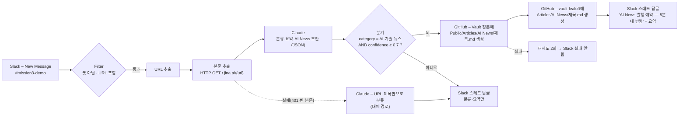

# 프로젝트 2 — Slack 링크 → AI 요약·분류 → Lea-Loft AI News 자동 발행

> 초안(2026-08-26). 구현·실행 증빙 항목은 워크플로우 구축 후 실측으로 채운다.

## 1. 자동화할 반복 업무 정의

읽을 만한 링크(AI 뉴스·기술 글)를 발견하면 **Slack 채널에 링크만 던진다**. 그러면 사람이 하던 다음 일이 자동으로 일어난다.

1. 링크를 열어 내용을 읽고
2. 어떤 종류의 글인지 분류하고(AI·기술 뉴스인지, 업무 자료인지, 그 외인지)
3. 핵심을 요약해서
4. AI 뉴스라면 운영 중인 교육 사이트 **Lea-Loft**의 「AI News」 코너에 글로 올린다.

지금까지는 링크 하나당 읽기 5~10분 + 글쓰기 15~20분이 들었고, 그래서 대부분의 링크는 결국 올라가지 못하고 흘러갔다. 자동화 대상은 이 전 과정이며, 사람은 링크를 보내는 것 외에 아무것도 하지 않는다(owner 결정: 메시지마다 자동 반영).

## 2. 도구 선정 및 선정 이유

**선정: Activepieces (Cloud, 무료)** — 프로젝트 1의 실측 비교 결과에 따라 확정한다. 선정 근거(예정 항목):

| 선정 이유 | 근거 |
|---|---|
| Slack 트리거가 즉시형 | Events API 기반 "New Message" — 폴링 없이 메시지 즉시 실행 |
| Claude 연동이 피스로 제공 | Anthropic Claude 피스(Ask Claude) — API 키만 연결 |
| GitHub 쓰기 | GitHub 피스 `Custom API Call`로 같은 OAuth 연결을 재사용해 contents API 호출 |
| 무료 범위 | 카드 등록 없이 무료, 일일 크레딧 갱신(실측 한도는 §7) |
| 오픈소스 | 필요 시 자가호스팅으로 이관 가능(과제 과금 가이드의 "자가호스팅 가능한 도구") |

## 3. 워크플로우 흐름



### 단계별 설명

| # | 단계 | 역할 | 주요 설정 |
|---|---|---|---|
| 1 | Slack – New Message | **Trigger**. 채널에 새 메시지가 오면 즉시 실행 | 채널 `#mission3-demo` |
| 2 | Filter | 봇(자기 답글) 메시지와 링크 없는 잡담을 걸러 무한 루프·낭비 방지 | `bot_id` 비어 있음 AND 본문에 `http` 포함 |
| 3 | URL 추출 | Slack 본문의 `<url\|텍스트>` 형식에서 URL만 꺼냄 | 정규식 `https?://[^\s\|>]+` |
| 4 | 본문 추출 | **Action**. 링크를 열어 본문을 마크다운으로 가져옴 | `GET https://r.jina.ai/{url}` (키 불필요) |
| 5 | Claude | **Action(보너스 1)**. 분류·태그·3줄 요약·AI News 글 초안을 JSON으로 생성 | 프롬프트 §4 |
| 6 | 분기 | **Router**. AI·기술 뉴스이고 확신도가 높을 때만 발행 경로 | `category ∈ {AI, 기술}` AND `confidence ≥ 0.7` |
| 7a | GitHub ×2 | **Action**. Vault 정본과 공개 저장소에 같은 글을 커밋 → Mac mini cron이 5분 내 사이트 반영 | contents API `PUT /repos/{owner}/{repo}/contents/{path}` |
| 7b | Slack 답글 | 발행 예약 안내 + 요약을 원 메시지 스레드에 | — |
| 8 | Slack 답글(아니오 경로) | 분류·요약만 스레드에 | — |

### 데이터 흐름

| 항목 | 값 |
|---|---|
| 입력 | Slack 메시지 텍스트(URL 포함) |
| 중간 | 본문 마크다운(제목 줄 `Title:` + 본문), Claude JSON `{title, category, tags[], summary, article_md, confidence}` |
| 출력 1 | `Vault/10_Domains/LOFT/Public/Articles/AI News/<title>.md` (private 정본) |
| 출력 2 | `vault-lealoft/Articles/AI News/<title>.md` (public, 사이트 소스) |
| 출력 3 | Slack 스레드 답글 |

Lea-Loft 글 형식은 frontmatter 없는 순수 마크다운이며 제목 = 파일명이다(기존 AI News 글과 동일). 글 말미에 출처 링크와 "자동 생성 초안" 표기를 넣는다.

## 4. Claude 프롬프트 (요지)

```
너는 링크 분류·요약기이자 Lea-Loft 'AI News' 코너의 필자다.
입력: URL, 제목, 본문(마크다운, 비어 있을 수 있음).
출력: 아래 JSON만 (설명·코드펜스 금지)
{
 "title": "글 제목(한국어, 파일명으로 쓰이므로 / : 등 특수문자 금지)",
 "category": "AI | 기술 | 업무 | 뉴스 | 영상 | 쇼핑 | 기타",
 "tags": ["...", "..."],
 "summary": "3줄 이내 한국어 요약",
 "article_md": "AI News 글 본문(마크다운). 첫 문단 = 무슨 일이 있었는지, 불렛 = 핵심 3~5개, 마지막 = 왜 중요한지 한 문단. 문체는 존댓말·해설조",
 "confidence": 0.0~1.0
}
본문이 없으면 URL·제목만으로 추정하고 confidence를 0.5 이하로 낮춘다.
```

## 5. 분기 경로 실행 증빙

| 경로 | 조건 | 실행 결과 |
|---|---|---|
| 예 (AI·기술 뉴스) | category AI/기술, confidence ≥ 0.7 | _실측 후 기입_ — GitHub 커밋 2건, Slack 답글, 5분 후 사이트 반영 캡처 |
| 아니오 | 그 외 분류 또는 낮은 확신도 | _실측 후 기입_ — Slack 답글만 |

## 6. 보너스 2 — 실패 알림 및 대체 경로

| 장치 | 설정 | 동작 |
|---|---|---|
| 대체 경로 | 본문 추출 실패(HTTP 오류·`Warning:`·빈 본문) → Claude에 URL·제목만 전달 | 본문이 없어도 분류·요약은 나오고 발행 경로는 타지 않음(확신도 낮음) |
| 재시도 | GitHub 커밋 단계 재시도 2회 | 일시 오류 흡수 |
| 실패 알림 | 재시도 후에도 실패 → Slack 스레드에 `❌ 발행 실패` + 오류 요약 | 사람이 확인할 수 있게 원 메시지 스레드에 남김 |

## 7. 자동 실행 확인·무료 범위

- _실측 후 기입_: 활성(Published) 상태, 실행 이력 캡처, Activepieces 무료 한도 화면.
- 유료 사용: **Claude API만**(owner 결정, 건당 수 원). Slack·GitHub·jina reader·Activepieces Cloud·Lea-Loft(자체 서버)는 전부 무료.

## 8. 보안 처리

- Claude API 키·GitHub 토큰은 도구 연결(Connection)에만 저장하고 문서·캡처에 노출하지 않는다.
- 캡처의 계정 이메일·조직명은 가림 처리한다.
- 공개 저장소에는 글 본문만 올라가며, Slack 메시지 원문·발신자 정보는 올리지 않는다.
