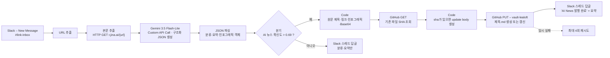

# 프로젝트 2 — Slack 링크 → AI 요약·분류 → Lea-Loft AI News 자동 발행

> Cloud 구현·발행 완료, Activepieces Community Edition 셀프호스팅 전환 준비 중
> (초안 2026-08-26, 모델 결정·성공 경로 실측 및 전환 착수 2026-08-27).

## 1. 자동화할 반복 업무 정의

읽을 만한 링크(AI 뉴스·기술 글)를 발견하면 **Slack 채널에 링크만 던진다**. 그러면 사람이 하던 다음 일이 자동으로 일어난다.

1. 링크를 열어 내용을 읽고
2. 어떤 종류의 글인지 분류하고(AI·기술 뉴스인지, 업무 자료인지, 그 외인지)
3. 핵심을 요약해서
4. AI 뉴스라면 운영 중인 교육 사이트 **Lea-Loft**의 「AI News」 코너에 글로 올린다.

지금까지는 링크 하나당 읽기 5~10분 + 글쓰기 15~20분이 들었고, 그래서 대부분의 링크는 결국 올라가지 못하고 흘러갔다. 자동화 대상은 이 전 과정이며, 사람은 링크를 보내는 것 외에 아무것도 하지 않는다(owner 결정: 메시지마다 자동 반영).

## 2. 도구 선정 및 선정 이유

**선정: Activepieces Community Edition (Lea-Loft Mac mini 셀프호스팅)** — 프로젝트 1의
실측 비교 결과에 따라 도구는 Activepieces로 확정했고, Cloud 무료 플랜의 실행 크레딧 대신
Lea-Loft 서버에서 Community Edition을 운영하기로 owner가 결정했다. 셀프호스팅 전환이
끝날 때까지 기존 Cloud 플로우는 중복 실행을 막기 위해 한시적으로 유지한다.

| 선정 이유 | 근거 |
|---|---|
| Slack 트리거가 즉시형 | Events API 기반 "New Message" — 폴링 없이 메시지 즉시 실행 |
| Gemini 연동이 피스로 제공 | Google Gemini 피스 — AI Studio에서 발급한 API 키만 연결 |
| GitHub 쓰기 | GitHub 피스 `Custom API Call`로 같은 OAuth 연결을 재사용해 contents API 호출 |
| 무료 범위 | Activepieces Community Edition 자체 서버 운영 + Gemini 3.5 Flash-Lite 무료 티어(실측 한도는 §7) |
| 오픈소스 | Activepieces 공식 Docker Compose를 바탕으로 Lea-Loft Mac mini에 함께 배치 |

## 3. 워크플로우 흐름



### 단계별 설명

| # | 단계 | 역할 | 주요 설정 |
|---|---|---|---|
| 1 | Slack – New Message | **Trigger**. 채널에 새 메시지가 오면 즉시 실행 | 채널 `#link-inbox` (`C0BSTS2255Y`) |
| 2 | URL 추출 | Slack 본문의 `<url\|텍스트>` 형식에서 URL만 꺼냄 | 정규식 `https?://[^\s\|>]+` |
| 3 | 본문 추출 | **Action**. 링크를 열어 본문을 마크다운으로 가져옴 | `GET https://r.jina.ai/{url}` (키 불필요) |
| 4 | Gemini 3.5 Flash-Lite | **Action(보너스 1)**. Google Gemini Connection의 Custom API Call로 분류·태그·3줄 요약·AI News 글 초안을 구조화 JSON으로 생성 | `POST .../v1beta/models/gemini-3.5-flash-lite:generateContent`, 프롬프트 §4 |
| 5 | JSON 파싱 | Gemini 응답의 `body.candidates[0].content.parts[0].text`를 분기에서 쓸 객체로 변환 | `{title, category, tags, summary, article_md, infographics, confidence}` |
| 6 | 분기 | **Router**. `confidence`를 AI·기술 뉴스 확신도로 정의하고 높은 경우에만 발행 경로 | `confidence > 0.69` |
| 7 | 파일 준비 | jina reader의 원문 `Title:`을 파일명 정본으로 삼고, 원문 링크와 선별한 원문 인포그래픽 URL을 본문에 첨부한 뒤 Base64로 변환 | `Articles/AI News/<source title>.md` |
| 8 | GitHub 기존 파일 조회 | 같은 경로의 현재 파일과 `sha`를 조회. 최초 생성의 404는 다음 단계가 처리하도록 오류로 중단하지 않음 | `GET /repos/sujileelea/vault-lealoft/contents/{path}` |
| 9 | upsert body 준비 | 기존 파일이면 `sha`를 포함하고 새 파일이면 생략한 contents API 요청 body 생성 | `{message, content, branch, sha?}` |
| 10 | GitHub 생성·갱신 | **Action**. 공개 저장소에 글을 생성하거나 같은 원문의 기존 글을 갱신 | `PUT /repos/sujileelea/vault-lealoft/contents/{path}` |
| 11 | Slack 답글(발행 경로) | 발행 완료 안내 + 제목·요약·사이트 링크를 원 메시지 스레드에 전송 | — |
| 12 | Slack 답글(보류 경로) | 제목·분류·확신도·요약만 스레드에 전송 | — |

### 데이터 흐름

| 항목 | 값 |
|---|---|
| 입력 | Slack 메시지 텍스트(URL 포함) |
| 중간 | 본문 마크다운(제목 줄 `Title:` + 본문), Gemini API 응답, 파싱된 JSON `{title, category, tags, summary, article_md, infographics, confidence}` |
| 출력 1 | `vault-lealoft/Articles/AI News/<source title>.md` (public, 사이트 소스) |
| 출력 2 | Slack 스레드 답글 |

Lea-Loft 글 형식은 frontmatter 없는 순수 마크다운이며 제목 = 파일명이다(기존 AI News 글과 동일). 글 말미에 원문 링크와 "자동 생성 초안" 표기를 넣고, 원문에 차트·도표·인포그래픽이 있으면 원본의 공개 `http(s)` 이미지 URL을 외부 임베드한다. 이미지 파일 자체를 복제하거나 새 URL을 만들지는 않는다. 공유 Vault는 동시 쓰기 안전 규칙상 `Vault/.ops/vault-git`만 커밋할 수 있으므로 Activepieces가 private Vault에 직접 쓰지 않는다. 자동화는 공개 배포 저장소만 갱신한다.

## 4. Gemini 프롬프트 (요지)

```
너는 링크 분류·요약기이자 Lea-Loft 'AI News' 코너의 필자다.
입력: URL, 제목, 본문(마크다운, 비어 있을 수 있음).
출력: 아래 JSON만 (설명·코드펜스 금지)
{
 "title": "글 제목(한국어, 파일명으로 쓰이므로 / : 등 특수문자 금지)",
 "category": "AI | 기술 | 업무 | 뉴스 | 영상 | 쇼핑 | 기타",
 "tags": ["...", "..."],
 "summary": "3줄 이내 한국어 요약",
 "article_md": "AI News 글 본문(마크다운). 첫 문단 = 무슨 일이 있었는지, 불렛 = 핵심 3~5개, 마지막 = 왜 중요한지 한 문단. 문체는 존댓말·해설조",
 "infographics": [{"alt": "원문 이미지 설명", "url": "원문의 공개 이미지 URL"}],
 "confidence": "이 글이 AI·기술 뉴스일 확신도 0.0~1.0"
}
본문이 없으면 URL·제목만으로 추정하고 confidence를 0.5 이하로 낮춘다.
infographics에는 원문에 실제로 있는 인포그래픽·차트·다이어그램의 http(s) URL만 그대로 넣는다.
로고·아이콘·아바타·일반 사진·추적 이미지는 제외하고 URL을 추측하거나 새로 만들지 않는다.
```

## 5. 분기 경로 실행 증빙

| 경로 | 조건 | 실행 결과 |
|---|---|---|
| 예 (AI·기술 뉴스) | `confidence > 0.69` | 2026-08-27 실측 성공. Router 통과 → 파일 준비 → GitHub `201 Created` → Slack 답글 성공 → 실사이트 제목·본문 노출 확인 |
| 아니오 | `confidence ≤ 0.69` | Router의 `Otherwise` 경로와 분류·확신도·요약 Slack 답글을 구성. 독립 실행 증빙은 남은 과제 |

### 구현·실행 캡처 파일

| 증빙 | 캡처 파일 | 확인할 수 있는 내용 |
|---|---|---|
| 구성 화면 1 | `캡처/AP_P2_구성_트리거_중복분기.png` | Slack Trigger → URL 처리 → Tables 중복 조회 → 신규/중복 Router → 본문 추출 → Gemini → JSON 변환 |
| 구성 화면 2 | `캡처/AP_P2_구성_AI발행분기.png` | AI News/Otherwise Router → GitHub 조회·생성/갱신 → Slack 결과 알림 |
| 실행 결과 | `캡처/AP_P2_실행결과_Slack.png` | 원본 링크의 Slack 스레드에 Activepieces 발행 완료, 핵심 요약, Lea-Loft 링크가 자동으로 등록된 결과 |

## 6. 보너스 2 — 실패 알림 및 대체 경로

| 장치 | 설정 | 동작 |
|---|---|---|
| 비발행 경로 | AI 뉴스 확신도가 낮으면 `Otherwise` | 공개 저장 없이 분류·확신도·요약만 Slack에 남김 |
| 재시도 | GitHub 커밋 단계 최대 4회 | 일시 오류 흡수 |
| 동명 파일 upsert | GitHub GET으로 기존 `sha`를 조회하고 PUT body에 조건부 포함 | 최초 생성과 같은 원문 재처리를 모두 지원. 최초 오류 `422 \"sha wasn't supplied\"`를 해소하고 기존 파일 갱신 `200` 확인 |
| 제목 안정화 | Gemini가 재시도마다 제목을 바꿀 수 있어 jina reader의 `Title:`을 파일명 정본으로 사용 | 같은 원문이 다른 제목의 중복 파일로 쌓이는 것을 방지 |
| 현재 제한 | 본문 추출 HTTP 단계의 대체 경로·최종 실패 알림 미구성 | 로그인 벽·빈 본문 링크는 실행 실패로 남을 수 있음 |

## 7. 자동 실행 확인·무료 범위

- 모델: `gemini-3.5-flash-lite`(Stable). 구조화 출력(JSON Schema), 최대 입력 1,048,576 tokens.
- Activepieces Google Gemini `v0.1.16`의 네이티브 모델 목록에는 3.5가 없어, 같은 Connection의 Custom API Call에서 모델 ID가 포함된 `generateContent` 엔드포인트를 직접 지정했다.
- 단일 액션 실측(2026-08-27): 공개 아티클 본문 8,028 input tokens, HTTP 200, 구조화 JSON 생성 성공, 응답 `modelVersion = gemini-3.5-flash-lite` 확인.
- 무료 한도 실측(2026-08-27, AI Studio 프로젝트): 15 RPM, 250,000 input TPM, 500 RPD. 실제 운영 한도는 AI Studio에서 재확인한다.
- Activepieces Cloud Free 실측: 100 credits/일이며 앞선 실행에서 크레딧 25% 사용을 확인했다. 이 제한을 없애기 위해 Community Edition 셀프호스팅으로 전환한다.
- 셀프호스팅 처리량은 Activepieces 크레딧이 아니라 Mac mini 자원과 Gemini 무료 한도에 의해 결정된다. 현재 저빈도 단일 플로우는 worker concurrency 1로 시작한다.
- 전체 성공 경로 실측(2026-08-27): JSON 파싱 성공, Router `AI News 발행` 평가 `true`, GitHub `201`, Slack 성공 응답, 플로우 Published, 공개 저장소와 `https://lea-loft.sigongan.com/`에서 새 글 확인.
- 동명 파일 재처리 실측(2026-08-27): GitHub GET → 조건부 `sha` PUT으로 기존 파일 갱신 `200` 확인. 실패했던 실행 2건을 최신 플로우로 재시도해 두 건 모두 14초 안에 성공했다.
- 원문 첨부 실측(2026-08-27): 결과 글에 `[원문 보기]` 링크를 넣고, Gemini 구조화 결과의 원문 인포그래픽 URL 8개를 파싱·임베드했다.
- 정리(2026-08-27): 원문 링크가 없던 Jina 중복 글 3건은 공개 저장소에서 삭제했다. `'Fugu'의 등장.md`는 owner가 지정한 예외로 원상 복구해 보존했다.
- 실측 파일: `Articles/AI News/Anthropic, 차세대 AI 모델 Claude Fable 5 및 Mythos 5 출시.md`.
- 남은 제출 증빙: 비발행 경로 독립 실행, 실패 처리, 최종 캡처·치트시트.
- 유료 사용 없음: Gemini API·Slack·GitHub·jina reader는 무료 범위를 사용하고,
  Activepieces Community Edition은 기존 Lea-Loft Mac mini에서 운영한다. 전환 완료 전까지만
  Cloud 무료 플로우를 유지하며, 셀프호스트 검증 직후 Cloud를 비활성화한다.

### 셀프호스팅 전환 상태 (2026-08-27)

- `Lea-Loft/web`의 로컬 `develop`에 Activepieces app·worker·PostgreSQL·Redis Compose와
  환경 파일 생성·백업 스크립트를 준비했다.
- 서비스는 `127.0.0.1:8080`에만 바인딩하고 Cloudflare Tunnel의
  `activepieces.sigongan.com` 호스트를 통해 공개할 계획이다.
- Cloud 플로우 JSON과 중복 URL 기록 CSV를 내보냈다. 연결 자격증명은 export에 포함되지 않아
  셀프호스트에서 Slack·Gemini·GitHub를 다시 연결해야 한다.
- Mac mini의 기존 SSH 주소와 Tailscale 주소가 모두 응답하지 않아 실제 배포와 DNS 전환은
  대기 중이다. 전환 성공 전에는 Cloud 플로우를 끄지 않는다.

## 8. 보안 처리

- Gemini API 키·GitHub 토큰은 도구 연결(Connection)에만 저장하고 문서·캡처에 노출하지 않는다.
- Gemini 무료 티어 입력은 Google 제품 개선에 사용될 수 있으므로 공개 아티클 본문·URL만 전달하고 Slack 사용자 정보와 비공개 대화는 전달하지 않는다.
- 캡처에는 계정 이메일·API Key·연결 토큰을 노출하지 않고, 워크플로우 증빙에 필요한 Slack 워크스페이스·채널·메시지만 포함한다.
- 공개 저장소에는 글 본문만 올라가며, Slack 메시지 원문·발신자 정보는 올리지 않는다.
- 인포그래픽은 원문의 공개 `http(s)` URL만 외부 임베드하며 이미지 바이너리를 저장소에 복제하지 않는다.
