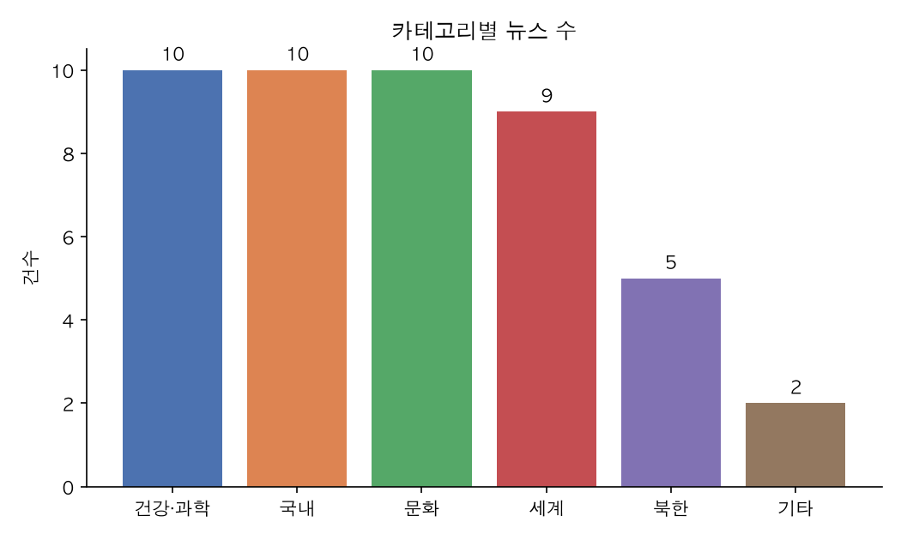
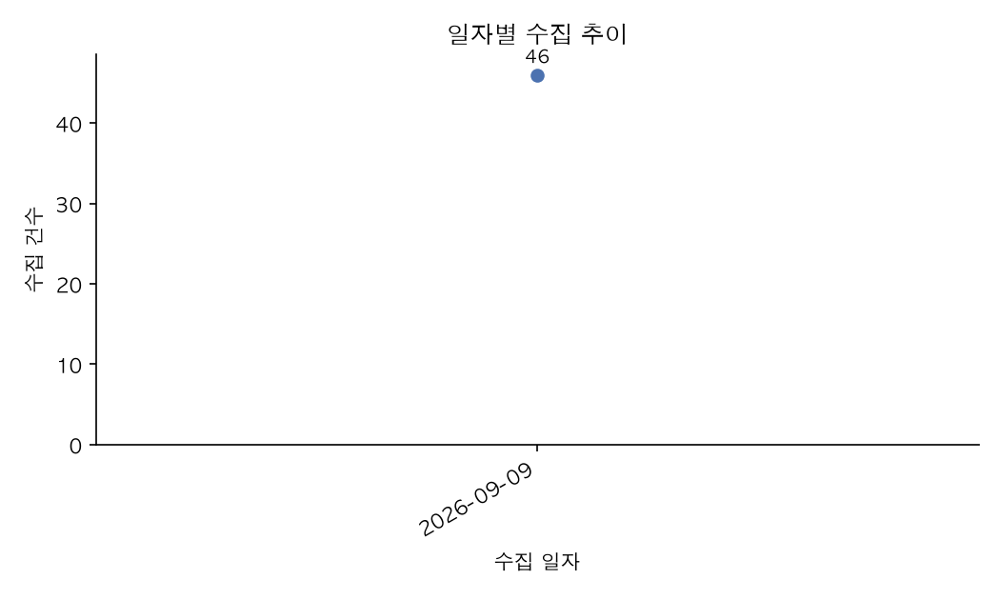
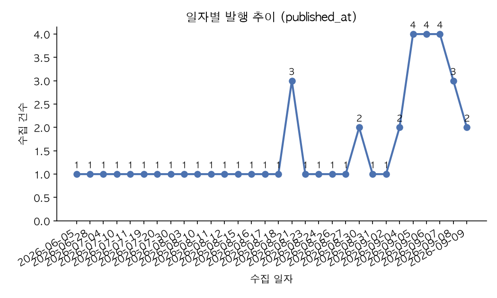
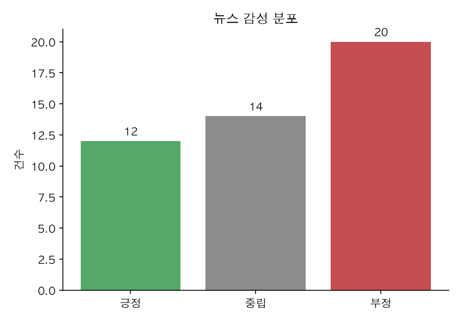

# 실행 결과 (2026-09-09, BBC News 코리아 실데이터)

`app/` CLI를 실제 소스와 Gemini 무료 티어로 끝까지 돌린 기록이다. 명령·로그는 `app/logs/app.log`에서 발췌했고,
산출 파일은 `app/output/`에 그대로 들어 있다. AI 응답 원문은 `app/data/news.db`(gitignore)에 저장돼 있다.

## 1. 실행 환경

| 항목 | 값 |
|---|---|
| Python | 3.13.5 (요구: 3.10+) · macOS |
| 뉴스 소스 | BBC News 코리아 — RSS `feeds.bbci.co.uk/korean/rss.xml` + 섹션·기사 페이지 크롤링(BeautifulSoup) |
| AI | Gemini `gemini-3.5-flash-lite`, google-genai SDK, 무료 티어(분당 15회 제한) |
| 저장소 | SQLite `app/data/news.db` — `raw_news`·`news`·`insights`·`sentiment_results` |
| 설정·비밀 | `config.json`(소스·정책·모델) + `.env`(`GEMINI_API_KEY`, 비커밋) |

## 2. 파이프라인 실행 기록

### 2-1. fetch — 수집 (방법 1 RSS + 방법 2 크롤링)

```text
$ python main.py fetch --limit 10
[INFO] 뉴스 수집 시작: source=all, limit=10, category=전체
[INFO] 섹션 페이지 요청: https://www.bbc.com/korean/topics/cxnyk3v82rgt
[INFO] 기사 링크 10개 추출
[INFO] [국내 1/10] 수집 완료: 네팔에서 '중국인 1명 구조'... 한국인 근무하던 발전소 터널서 발견
[INFO] [국내 2/10] 수집 완료: '내 가족이 사라진다면?' 사립탐정이 말하는 성인 실종 대처법
...   (세계·북한·건강·과학·문화 섹션 동일, 요청 간 1.5초 지연)
[INFO] 크롤링 수집: 50건 성공, 0건 실패
[INFO] RSS 요청: https://feeds.bbci.co.uk/korean/rss.xml
[INFO] RSS 항목 10건 파싱
[INFO] RSS 본문 보강: 크롤링 raw와 겹치는 8건은 재요청 생략
[INFO] [1/2] 본문 보강 완료 (3669자)
[INFO] [2/2] 본문 보강 완료 (6768자)
[INFO] RSS 수집: 10건 저장
[INFO] 수집 완료: 60건 성공, 0건 실패
[INFO] raw 저장소에 저장 완료: …/app/data/news.db
```

| raw 저장 결과 | 값 |
|---|---|
| 크롤링(`collection_method=crawl`) | 50건 (섹션 5 × 10), 평균 본문 3,305자, 발행시각 결측 0 |
| RSS(`collection_method=rss`) | 10건, 그중 8건은 크롤링과 같은 기사(본문 재요청 생략), 2건은 본문 보강 |
| 소요 | 약 1분 30초 (총 62회 HTTP 요청) |

### 2-2. clean — 정제·중복 처리

```text
$ python main.py clean
[INFO] 정제 대상: 60건 (정책=skip)
[INFO] raw_id=1 처리 완료: inserted, news_id=1
...
[INFO] raw_id=59 처리 완료: skipped, news_id=17
[INFO] raw_id=60 처리 완료: skipped, news_id=25
[INFO] 정제 완료: 신규 46건, 수정 0건, 중복 14건, 실패 0건
```

- 중복 14건 = 여러 섹션에 동시에 실린 기사(예: 북한 섹션 10건 중 5건이 국내·세계와 겹침) + RSS와 크롤링이 겹친 8건 중 일부.
  RSS 링크의 `?at_medium=RSS&at_campaign=rss`는 URL 정규화로 제거돼 같은 URL로 판정됐다.
- 카테고리 분포: 국내 10 · 문화 10 · 건강·과학 10 · 세계 9 · 북한 5 · 기타 2(RSS에만 있던 기사 — 섹션 정보 없음).
- 발행시각은 RSS(RFC 2822, GMT)와 JSON-LD(ISO, UTC) 두 형식이 모두 `YYYY-MM-DD HH:MM:SS`(KST)로 통일됐다.

### 2-3. summarize — AI 요약 (오류 처리 실측 포함)

첫 시도는 경학 파트 기본값이던 `gemini-2.5-flash-lite`가 **신규 사용자에게 종료(404)** 되어 실패했고, 두 번째는
무료 티어 **분당 15회 한도(429)** 에 걸렸다. 두 경우 모두 "실패 로깅 후 스킵"이 의도대로 동작했다.

```text
$ python main.py summarize --unsummarized --limit 3          # 모델 종료 → 전건 실패·스킵
[WARNING] AI 요약 시도 1/2 실패: 404 NOT_FOUND. {'error': {... 'This model models/gemini-2.5-flash-lite is no longer available to new users. Please update your code to use models/gemini-3.5-flash-lite ...'}}
[WARNING] AI 요약 시도 2/2 실패: 404 NOT_FOUND. ...
[WARNING] [1/3] ID=1 요약 실패 → 스킵
[INFO] 요약 완료: 0건 성공, 3건 실패, 0건 스킵

$ python main.py summarize --unsummarized --limit 3          # config ai.model → gemini-3.5-flash-lite
[INFO] 요약 대상: 3건 (mode=unsummarized, force=False)
[INFO] [1/3] ID=1 요약 완료 (494자 → 225자)
[INFO] [2/3] ID=2 요약 완료 (508자 → 243자)
[INFO] [3/3] ID=3 요약 완료 (3045자 → 236자)
[INFO] 요약 완료: 3건 성공, 0건 실패, 0건 스킵

$ python main.py summarize --all --limit 60                  # 분당 한도(429) → 26건 실패·스킵, 기요약 3건 스킵
[INFO] [1/46] ID=1 이미 요약됨 → 스킵
...
[WARNING] AI 요약 시도 1/2 실패: 429 RESOURCE_EXHAUSTED. {'error': {... 'Quota exceeded for metric: generativelanguage.googleapis.com/generate_content_free_tier_requests, limit: 15, model: gemini-3.5-flash-lite\nPlease retry in 21.7s.' ...}}
[INFO] 요약 완료: 17건 성공, 26건 실패, 3건 스킵

$ python main.py summarize --unsummarized --limit 60         # 호출 간격 4.5초 + 429 대기 재시도 추가 후
[INFO] 요약 대상: 26건 (mode=unsummarized, force=False)
[INFO] 요약 완료: 26건 성공, 0건 실패, 0건 스킵
```

요약 예시 (ID 1, 494자 → 225자):

> 네팔 구조당국이 대홍수 발생 10일 만에 한국인이 근무하던 수력발전소 공사 현장 터널 내부에서 중국인 직원을 구조했다.
> 이번 구조 작업에는 네팔군과 외국 구조대원 및 대한민국 해외긴급구호대가 함께 참여했다. 앞서 다른 발전소 터널에서도
> 생존자가 발견된 데 이어 추가 생존자 구조에 대한 기대가 커지고 있다. 한편 네팔군은 누와코트 지역의 가옥 잔해에 매몰되어
> 있던 60대 여성도 함께 구조했다고 밝혔다.

최종: 46/46건 요약 완료, 평균 3,588자 → 238자(압축률 6.6%).

### 2-4. analyze — AI 인사이트 분석

```text
$ python main.py analyze --limit 60
[INFO] AI 분석 요청 중...
[INFO] 선택된 clean 뉴스: 46건
[INFO] 정성 분석 대상: 46건 / 배치 수: 3 / 배치 크기: 20
[INFO] 배치 분석 1/3 (20건)
[INFO] 배치 분석 2/3 (20건)
[INFO] 배치 분석 3/3 (6건)
[INFO] 배치 결과 종합(Reduce) 분석 시작
[INFO] 분석 완료

=== AI 인사이트 분석 결과 ===
저장 ID: 1
조건: 처음 ~ 현재 · 카테고리 전체
선택 뉴스: 46건 · 요약 사용 뉴스: 46건

[주요 트렌드]
- 기후변화와 자연재해로 인한 인프라 피해 및 인도주의적 위기 발생
- 현대인의 수면, 스트레스, 정신 건강 및 웰빙에 대한 관심 증가
- 저출생 위기 극복을 위한 사회적 제도 변화 및 다양한 시도 진행

[핵심 키워드]
정착촌 제재, 한미연합훈련, 김정은, 트럼프, 선택적 모병제, 테일러 스위프트

[주요 이슈]
- 네팔 대홍수로 인한 한국인 수력발전소 직원 실종 및 생존자 수색 구조 작업 진행
- 도널드 트럼프 미국 대통령의 한미 연합 군사훈련 대폭 축소 지시와 한미 동맹 신뢰 우려
- 저출생에 따른 병력 감소 대응을 위한 선택적 모병제 도입 추진과 이에 대한 논란
- 저출생 위기 극복을 위해 경북 동화사에서 개최된 미혼남녀 사찰 소개팅 행사
```

```text
$ python main.py analyze --category 세계 --date-from 2026-08-01 --date-to 2026-09-09
저장 ID: 2 · 선택 뉴스: 9건
[주요 트렌드]
- 각국 정부 및 국제기구의 제재와 정책 변화가 이어지고 있다
- 지정학적 갈등과 대립이 외교 및 안보 문제로 확산하고 있다
- 자연재해와 돌발 사고가 교통 및 물류 인프라에 타격을 주고 있다
[핵심 키워드]
정착촌, 러시아, 우크라이나, 화산, 아마존, 지도
[주요 이슈]
- 영국 프랑스 캐나다의 서안지구 정착촌 제재와 이스라엘의 반발
- 독일 AfD당의 선거 압승과 유럽 정치 혼란
- 인도네시아 아낙 크라카타우 화산 분화로 인한 공항 폐쇄 및 결항
- 미국 마이애미 국제공항 화물기 활주로 이탈 사고

$ python main.py analyze --list
ID=2 | 2026-09-09 20:55:23 | 2026-08-01~2026-09-09 | 세계 | 9건
ID=1 | 2026-09-09 20:55:21 | 처음~현재 | 전체 | 46건

$ python main.py analyze --show 1      # 저장된 결과 재조회 (위와 동일 출력)
```

### 2-5. sentiment — 감성 분석 (보너스)

```text
$ python main.py sentiment --limit 50
[INFO] 감성 분석 대상: 46건
[INFO] [1/46] ID=46 감성 분석 완료: negative (-0.60)
...
=== AI 감성 분석 결과 ===
선택 뉴스: 46건 · 분석 완료: 46건 · 실패: 0건 · 본문 없음 스킵: 0건
- ID=41 | positive | score=0.60 | 사찰에서 열린 지자체 지원 소개팅 행사를 통해 참가자들이 새로운 인연을 만나고 긍정적인 경험과 자신감을 얻었으며 …
- ID=21 | neutral  | score=0.00 | … 여야의 찬반 입장이 팽팽하게 맞서고 제도의 구체적 실효성에 대한 우려와 반론이 함께 제시되어 있어 전반적인 방향성이 중립적이다.
- ID=44 | positive | score=0.80 | 르세라핌이 멤버 간의 갈등을 극복하고 악성 비난을 음악으로 승화시키며 … 성공적으로 성장하고 있는 모습을 긍정적으로 다루고 있습니다.
```

분포: 부정 20건(43.5%) · 중립 14건(30.4%) · 긍정 12건(26.1%). 소요 약 6분(호출 간격 4.5초 × 46건).

### 2-6. report — 리포트·차트

```text
$ python main.py report --format md
[INFO] 차트 한글 폰트: AppleGothic
[INFO] 차트 저장: …/output/charts/category_counts.png
[INFO] 차트 저장: …/output/charts/daily_collected.png
[INFO] 차트 저장: …/output/charts/daily_published.png
[INFO] 차트 저장: …/output/charts/sentiment_counts.png
[INFO] 리포트 저장: …/output/report.md
```

리포트 전문: [`app/output/report.md`](../app/output/report.md) · [`report.txt`](../app/output/report.txt)

| 품질 지표 | 값 |
|---|---:|
| 수집 원본(raw) | 60건 (RSS 10 · 크롤링 50) |
| 정제 통과(clean) | 46건 |
| 중복 제거율 | 23.3% |
| 요약 완료율 | 100.0% (46/46) |
| 평균 본문 / 요약 길이 | 3,588자 / 238자 (압축률 6.6%) |
| 날짜 결측 | 0건 |
| 감성 분석 완료 | 46건 |

TOP 5 카테고리: 건강·과학 10 · 국내 10 · 문화 10 · 세계 9 · 북한 5.

| 차트 | 파일 |
|---|---|
| 카테고리별 뉴스 수 |  |
| 일자별 수집 추이 (collected_at) |  |
| 일자별 발행 추이 (published_at) |  |
| 감성 분포 (보너스) |  |

### 2-7. export — 내보내기

```text
$ python main.py export --format csv --status summarized
[INFO] 내보내기 완료: 46건 → …/output/exports/news_summarized_20260909.csv
$ python main.py export --format xlsx
[INFO] 내보내기 완료: 46건 → …/output/exports/news_all_20260909.xlsx
$ python main.py export --format jsonl
[INFO] 내보내기 완료: 46건 → …/output/exports/news_all_20260909.jsonl
```

컬럼: `id, title, url, category, source, published_at, collected_at, status, summary, summary_model, summarized_at, sentiment, sentiment_score, content`.

### 2-8. list / show — 조회 (보너스)

```text
$ python main.py list --category 문화 --page 1 --page-size 5
총 10건 · 페이지 1/2 (페이지당 5건)
  ID  발행일               카테고리    상태          감성        제목
  35  2026-08-21 16:05  문화      summarized  neutral   해리왕자 부부 귀환 소식에…영국서 '경호' 문제 다시 수면 위로
  36  2026-08-15 14:04  문화      summarized  negative  '자신의 모습을 한 인형을 내게 주었다': 피델 카스트로의 딸이 …
  ...

$ python main.py list --keyword 트럼프 --status summarized --page-size 5
총 9건 · 페이지 1/2 (페이지당 5건)

$ python main.py show 44
=== 뉴스 ID 44 ===
제목    : 르세라핌: 멤버간 문제도, 대중의 비난도 음악으로 풀어내는 '피어리스'한 아이돌
카테고리: 문화 · 소스: bbc_korean
발행    : 2026-06-05 14:10:25 · 수집: 2026-09-09 20:51:17
요약    : K팝 걸그룹 르세라핌은 멤버 간의 소통과 갈등을 솔직하게 마주하고 …
감성    : positive (score 0.8) — …
본문    : (전문)
```

## 3. 오류 처리 실측

| 상황 | 명령 | 결과 |
|---|---|---|
| HTTP 타임아웃 | `http.timeout=0.001`로 `fetch --source rss` | `[WARNING] 타임아웃 (1/2)…(2/2)` → `[ERROR] RSS 수집 실패` → `수집 완료: 0건 성공, 1건 실패`, 종료 코드 1 |
| AI 모델 종료(404) | `summarize` (구 모델명) | 건별 2회 재시도 후 `요약 실패 → 스킵`, 다음 건 계속, 종료 코드 1 |
| AI 한도 초과(429) | `summarize --all` 43건 연속 | 17건 성공 후 429 → 26건 스킵. 이후 호출 간격·대기 재시도로 26/26 성공 |
| API 키 없음 | `.env` 제거 후 `summarize` | `[ERROR] 실행 실패: 환경변수 GEMINI_API_KEY에 … 설정되어 있지 않습니다`, 종료 코드 1. `list`·`report`·`export`는 키 없이 정상 |
| 필수 필드 결측 | 본문 없는 raw | `[WARNING] raw_id=… 정제 실패: 본문이 없습니다.` 후 계속 (모의 데이터 실측) |
| 중복 정책 | 같은 raw를 `skip` / `upsert --all` | skip: 중복 14건 · upsert: 수정, 본문 동일 시 요약 보존 (테스트로 검증) |
| 잘못된 인자 | `analyze --category IT`, `list --date-from 2026-09-10 --date-to 2026-09-01` | `[ERROR]` 안내, 종료 코드 2 |

## 4. 테스트

```text
$ python -m pytest -q
...........................                                              [100%]
27 passed in 0.12s
```

정제 규칙(URL 정규화·날짜 형식·필수 필드), 저장 정책(append-only·processed·skip/upsert·요약 보존), 수집 파서(RSS·목록·기사),
요약 흐름(스킵·강제·API 실패), 인사이트 배치/검증·감성 검증(Mock)을 다룬다.

## 5. 과제 요구사항 대조

| 요구 | 충족 근거 |
|---|---|
| argparse 서브커맨드 fetch/clean/summarize/analyze/report/export | `main.py`, 옵션 `--limit --category --date-from/--date-to --format --status` 등 |
| 방법 1 API/RSS + 방법 2 크롤링 | `collector/rss.py`(RSS) · `collector/crawler.py`(BeautifulSoup) |
| 타임아웃·오류 처리 | `collector/http_client.py` (timeout 10s, 재시도 2, 4xx 즉시 실패, 5xx·연결·타임아웃 재시도) |
| raw 저장(수집 시각·소스·방법) | `raw_news.collected_at / source / collection_method / raw_data` |
| 정제 4규칙 + skip/upsert + clean 분리 | `cleaner.py` · `storage.save_clean_article` · `news` 테이블 |
| AI 요약 `--all/--id/--unsummarized`, 실패 스킵, 기요약 스킵 | `summarizer.py`, §2-3 로그 |
| 인사이트 2항목 이상, 저장·조회 | trends·keywords·major_issues → `insights`, `analyze --show/--list` |
| matplotlib 2종 + 한글 + PNG | 4종 PNG, AppleGothic 적용 (§2-6) |
| 리포트: 품질 지표 2+, TOP N 1+, AI 인사이트, 콘솔+TXT/MD | 지표 8 · TOP N 3 · 인사이트 · md/txt |
| 내보내기 2포맷 이상 + `--status summarized` | CSV·JSONL·XLSX |
| config.json + logging 3레벨 | `config.json` · `log.py` (콘솔+`logs/app.log`, INFO/WARNING/ERROR 실측) |
| 영구 저장소 · 모듈 4개 이상 | SQLite · 파이썬 모듈 19개 (`app/` 12 + `collector/` 4 + `report/` 3) |
| 보너스: list/show 필터·페이지 · 감성 분석+시각화 · cron 안내 | §2-8 · §2-5 + `sentiment_counts.png` · `app/README.md` §정기 실행 |
